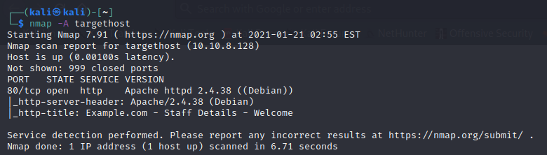

Write up

# Network scanning

Bắt đầu với việc scanning xem IP của machine:

```bash
nmap -sn 10.10.8.0/24
```


Đặt **10.10.8.128** là **targethost** trong **/etc/hosts** để dễ dàng hơn trong việc ghi nhớ mục tiêu:


Sử dụng nmap với aggressive mode để enable OS detection, version detection, script scanning, traceroute:

```bash
nmap -A 10.10.8.128
```



Chỉ có mỗi port 80 của machine là open, vậy tiếp theo cần mở web bằng browser để xem.

# Tìm kiếm lỗ hổng trên web

Có một form dùng để tìm kiếm request đến result.php:


Sử dụng thử một payload đơn giản:

```
abc' or 1=1 -- -
```

Kết quả là:


# Exploit

Để nhanh hơn kiểm tra sql injection bằng sqlmap: thực hiện tìm kiếm thử và dùng burpsuite bắt lại để lưu lại request để sử dụng sqlmap.


Sử dụng sqlmap:

```bash
sqlmap -r targethost_search_request.txt
```


Thêm vài lệnh để dump thêm database trong các table, kết quả có 2 database: Staff, users. Dữ liệu trong từng database như sau:


Với tài khoản admin đứng một mình, có lẻ đây là tài khoản để đăng nhập vào web, sử dụng trang crackstation để tìm ra password ban đầu vì password đã bị hash. Kết quả thu được là "**transorbital1**"


Đăng nhập thành công nhưng chú ý một xíu sẽ thấy một thông báo "File dose not exist", tức là trang nhận thêm parameter nào đó để đọc file? Đó là parameter file (phần này là đoán chứ đọc write up cũng không thấy):


Nhưng file /etc/passwd cũng không giúp được gì, lay hoay đọc writeup và tìm hiểu thì biết được một kỹ thuật là **knock port**, đây là một kỹ thuật để bảo mật port, khi knocking đúng port và đúng trình tự xác định trước thì sẽ cho phép kết nối đến port nào đó. File cấu hình trình tự knock nằm ở **/etc/knockd.conf**:


Sử dụng lệnh:

```bash
knock -v targethost 7469 8475 9842
```

Bây giờ scanning lại targethost đã có SSH:


Trong đây có cỡ chục tài khoản, sử dụng **hydra** để thử các username, password qua ssh. Đầu tiên xuất các username và password ra file:


Dùng hydra:

```bash
hydra -C creds.txt targethost ssh
```


Đăng nhập thử thì thư mục chính không có gì, trừ user janitor có thư mục **.secrets-for-putin** gồm file **passwords-found-on-post-it-notes.txt**:

```
BamBam01
Passw0rd
smellycats
P0Lic#10-4
B4-Tru3-001
4uGU5T-NiGHts
```

Có thể đây là mật khẩu của một ai đó trong list đó, nhưng phải chuyển sang chế độ brutce force các trường hợp nên phải chia username và password thành 2 file, thêm các password mới vào và bắt đầu:


User đầu tiên xuất hiện mình đã thấy rằng đi đúng hướng vì lúc đầu thoáng nhìn trong danh sách thì fred là System admin:


Nhưng khi ssh vô thì thấy user này cũng không có gì cả, đọc writeup thì thấy họ dùng lệnh `sudo -l` để liệt kê ra các quyền đặt biệt (kiểm tra các lệnh với quyền root nhưng không cần password):


Vậy fredf có thể thực thi file **/opt/devstuff/dist/test/test** với quyền root mà không cần mật khẩu.


Chương trình cần thêm 2 tham số là read và append. Lùi ra một xíu có một chương trình python tại **/opt/devstuff/test.py**. Nhìn output của chương trình chắc rằng đây là code của chương trình lúc nãy.


Nội dung chương trình sẽ đọc nội dung file của tham số đầu tiên và thêm vào cuối file của tham số thứ 2. Vậy thêm vào file gì mà có được quyền root??? => **/etc/passwd**
Tìm hiểu về file /ect/passwd cái đã :))


Sơ sơ là vậy, còn đầy đủ hơn thì xem ở [link này](https://kipalog.com/posts/Tep-tin--etc-shadow-trong-linux).

Đầu tiên tạo ra hash cho password:

```
$ openssl passwd -1 -salt h40huynh 123456
$1$h40huynh$NC6F6mHYM0eO.s.5QunQm.
```

Vậy chuỗi cần thêm vào là `hnhao:$1$h40huynh$NC6F6mHYM0eO.s.5QunQm.:0:0::/root:/bin/bash` để có được user hnhao:123456

Tada :))

